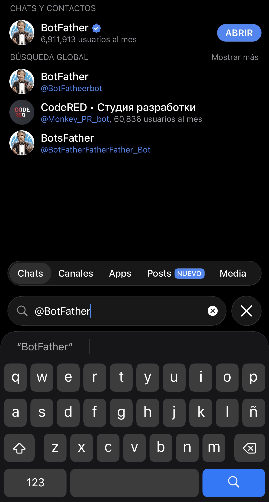
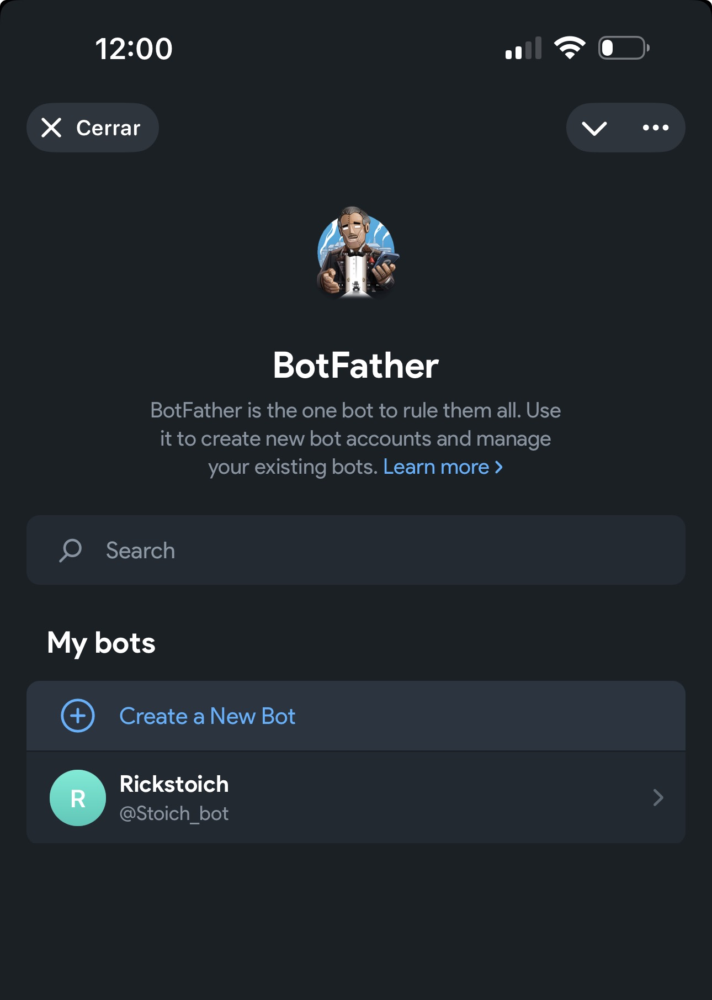
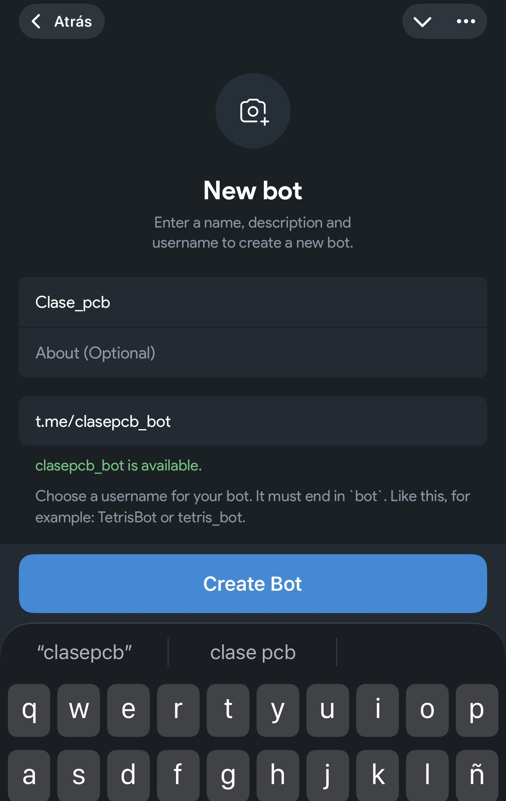
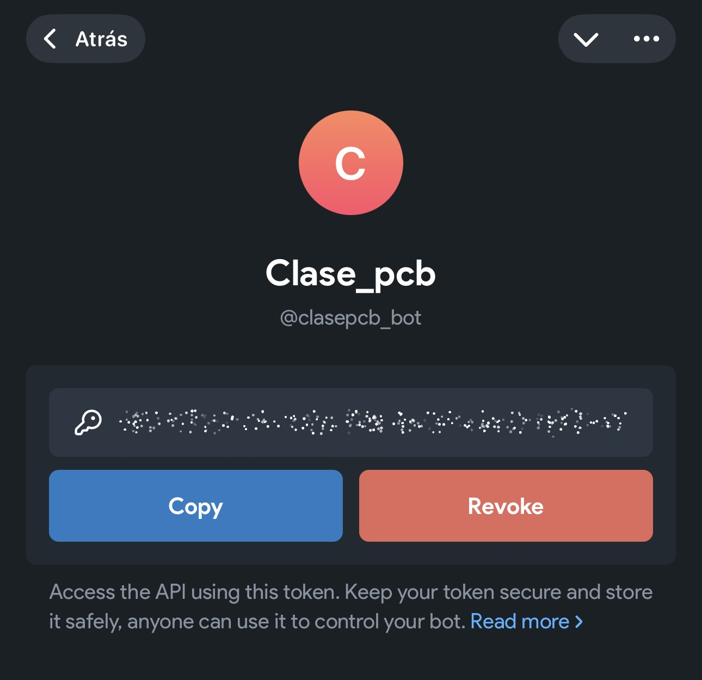
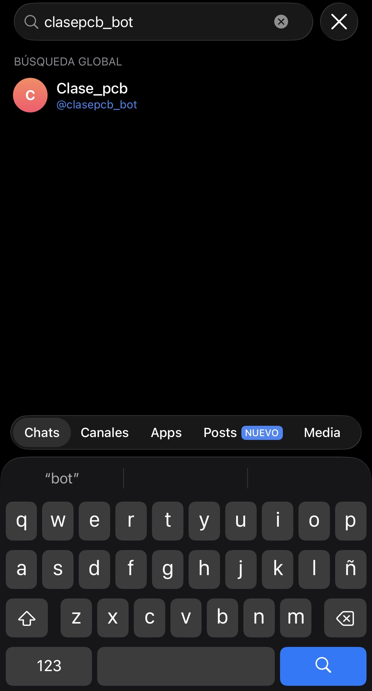
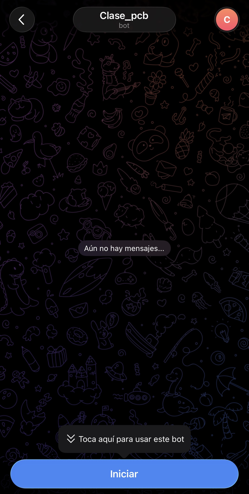

## En Telegram:

1.  Busca **\@BotFather y ABRIR**

{fig-align="center" width="350"}

2.  Crear un nuevo Bot

{fig-align="center" width="350"}

3.  Ponle un **nombre al Bot** y elige un **nombre de usuario** que termine en `bot`, el `usarname` tiene que estar disponible

{fig-align="center" width="350"}

4.  BotFather te dará un **TOKEN**

{fig-align="center" width="350"}

✅ Ese token es tu “contraseña” del bot, **No lo compartas**!!!

5.  Abre el chat con tu bot (búscalo por `username`).

{fig-align="center" width="350"}

6.  Presiona **Iniciar**

{fig-align="center" width="350"}

## Conseguir tu `chat_id` (para mandarte mensajes)

``` bash
TOKEN="TU_TOKEN_AQUI"
curl -s "https://api.telegram.org/bot${TOKEN}/getUpdates" 
```

Busca en la salida algo así:

``` bash
"chat":{"id":123456789,"first_name":"Pedro", ...}
```

📌 **"id":123456789** ese número es tu `CHAT_ID`.

### Enviar un mensaje con `curl` (lo esencial)

``` bash
TOKEN="TU_TOKEN_AQUI"
CHAT_ID="TU_CHAT_ID_AQUI"

curl -s -X POST "https://api.telegram.org/bot${TOKEN}/sendMessage" \
  -d "chat_id=${CHAT_ID}" \
  -d "text=Hola 👋 Mensaje enviado desde Bash"
```

## Buenas prácticas: NO hardcodear el token (y no subirlo a git)

### Archivo `.env` (recomendado)

Crea un archivo `.env` **fuera de tu repo** o ignóralo con `.gitignore`:

``` bash
nano .env
```

Pegar la info en el archivo `.env`

``` bash
TOKEN="TU_TOKEN_AQUI"
CHAT_ID="TU_CHAT_ID_AQUI"
```

En tu script agrega estas lineas

``` bash
source .env
```

SI esta en tu proyecto `git` agrega el archivo a tu `.gitignore`:

``` bash
nano .gitignore
```

Y agrega el archivo

``` bash
.env
```

Además agregar seguridad al archivo

``` bash
chmod 600 .env
```

## Función reusable `tg_send` (para cualquier script)

``` bash
tg_send () {
  local msg="$1"
  curl -s -X POST "https://api.telegram.org/bot${TELEGRAM_BOT_TOKEN}/sendMessage" \
    -d "chat_id=${TELEGRAM_CHAT_ID}" \
    -d "text=${msg}" \
    -d "disable_web_page_preview=true" > /dev/null
}
```

Uso:

``` bash
tg_send "✅ Pipeline terminó correctamente."
```
