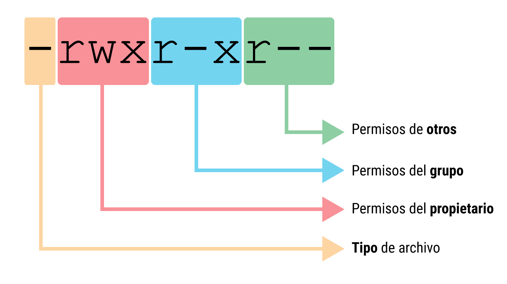

## Linux y sus distribuciones (DEB y RPM)

Linux no es un solo programa, sino un **núcleo (kernel)** sobre el que se construyen distintos “sabores” llamados **distribuciones**.\
Una forma práctica de agrupar distribuciones es por **cómo instalan software** (paquetes):

-   **Familia DEB (Debian/Ubuntu)**: usa paquetes `.deb`. Suele ser la más “amigable” y es muy común en bioinformática.
-   **Familia RPM (Red Hat/Fedora/CentOS/Rocky)**: usa paquetes `.rpm`. Es común en servidores, clusters y ambientes institucionales.

{fig-align="center" width="700"}

### Distribuciones base Debian (.deb)

-   [**Debian**](https://www.debian.org): base original; muy estable y comunitaria.\
-   [**Ubuntu**](https://ubuntu.com): muy popular; ideal para principiantes y con gran soporte de software.\
-   [**Linux Mint**](https://www.linuxmint.com): escritorio clásico; familiar si vienes de Windows.\
-   [**Pop!\_OS**](https://pop.system76.com): orientada a flujos de trabajo científicos/desarrollo y NVIDIA.\
-   [**Kali Linux**](https://www.kali.org): enfocada en seguridad informática.\
-   [**MX Linux**](https://mxlinux.org): ligera; útil en equipos con pocos recursos.\
-   [**Tails**](https://tails.net): privacidad y anonimato como prioridad.

### Distribuciones base Red Hat (.rpm)

-   [**Fedora**](https://fedoraproject.org): vanguardista; suele incluir versiones recientes de software.\
-   [**RHEL (Red Hat)**](https://www.redhat.com): estándar empresarial; robusta con soporte corporativo.\
-   [**Rocky Linux**](https://rockylinux.org): sucesor comunitario de CentOS; enfocada en servidores/clusters.\
-   [**AlmaLinux**](https://almalinux.org): clon comunitario de RHEL; estable.\
-   [**openSUSE**](https://www.opensuse.org): destaca por YaST (panel de control).\
-   [**Oracle Linux**](https://www.oracle.com/linux/): orientada a centros de datos y bases de datos.\
-   [**Mageia**](https://www.mageia.org): opción independiente enfocada en usuario general.

## Ver componentes del sistema en Linux (CPU, RAM, discos y red)

### CPU (procesador)

Esta sección reúne comandos rápidos para identificar recursos y configuración básica del equipo (útil antes de correr análisis bioinformáticos).

``` bash
lscpu
```

Útil para ver:

-   arquitectura (x86_64/arm64),

-   núcleos/hilos,

-   modelo de CPU,

-   sockets.

Si quieres solo lo más importante:

```         
lscpu | egrep 'Model name|Socket|Core|Thread|CPU\(s\)|MHz'
```

### Memoria RAM

``` bash
free -h
```

-   `total`: RAM total

-   `used`: usada

-   `available`: disponible “real” para procesos nuevos (muy útil)

### Almacenamiento (uso de discos y particiones)

Ver uso por partición montada:

``` bash
df -h
```

Ver el “árbol” de discos/particiones y puntos de montaje:

``` bash
lsblk
```

### Red (IP y estado de interfaces)

Ver interfaces y direcciones IP:

``` bash
ip a
```

Solo direcciones (más limpio):

``` bash
ip -br a
```

## Variables de entorno

Las **variables de entorno** son valores dinámicos que informan al sistema operativo y a los programas sobre cómo deben comportarse. Imagínalas como una pequeña libreta de direcciones o configuraciones que Linux consulta constantemente para saber dónde están las cosas.

### 1. ¿Para qué sirven?

En lugar de que cada programa tenga que adivinar dónde están tus archivos o qué idioma usas, el sistema define variables globales. Por ejemplo:

### Variables de Identificación y Usuario

-   **`$USER`**: Muestra el nombre del usuario que ha iniciado la sesión actual.

-   **`$UID`**: El número de identificación único del usuario (el del usuario raíz o root siempre es 0).

-   **`$HOME`**: La ruta completa al directorio personal del usuario (donde guardas tus documentos y descargas).

-   **`$SHELL`**: Indica qué intérprete de comandos estás usando (usualmente `/bin/bash` o `/bin/zsh`).

-   **`$LOGNAME`**: Similar a `$USER`, es el nombre utilizado durante el proceso de login.

### Variables de Navegación y Ubicación

-   **`$PATH`**: La variable más crítica. Contiene una lista de carpetas separadas por dos puntos (`:`) donde el sistema busca los programas cuando escribes un comando.

-   **`$PWD`**: Guarda la ruta del directorio donde te encuentras parado en este momento (Print Working Directory).

-   **`$OLDPWD`**: Guarda la ruta del directorio en el que estabas justo antes del actual (permite regresar con `cd -`).

-   **`$HOSTNAME`**: El nombre de la computadora en la red.

### Variables de Configuración del Sistema

-   **`LANG`**: Define el idioma, la región y la codificación de caracteres del sistema (ej. `es_ES.UTF-8`).

-   **`$EDITOR`**: Define qué programa se abre por defecto cuando el sistema necesita que edites un texto (ej. `nano` o `vim`).

-   **`$TERM`**: Informa a los programas qué tipo de terminal estás emulando para saber cómo mostrar colores y caracteres.

-   **`$DISPLAY`**: Se utiliza en entornos gráficos para saber en qué pantalla deben aparecer las ventanas de las aplicaciones.

### Variables de Sesión y Temporalidad

-   **`$TMPDIR`**: Indica la carpeta donde las aplicaciones deben guardar sus archivos temporales (normalmente `/tmp`).

-   **`$MAIL`**: La ubicación donde el sistema guarda los correos electrónicos internos del usuario.

-   **`$HISTSIZE`**: Define cuántos comandos puede recordar tu terminal en el historial (los que ves al presionar la flecha arriba)

> **TIP1:** Si instalas programas de bioinformática manualmente (descargando archivos binarios), casi siempre tendrás que modificar la variable **`$PATH`** para que el sistema "encuentre" el programa sin que tengas que escribir la ruta completa cada vez.

> **TIP2:** Las variables de ambiente también se utilizan para Windows y Mac OS, sólo cambia la sintaxis.

### Comandos de Bash para gestionar variables

-   **Listar todas las variables:** el comando lista las variables que el sistema tiene configuradas en este momento.

``` bash
printenv
env
```

-   **Mostrar el valor de una variable:** Usa `echo $NOMBRE_VARIABLE`. Es fundamental incluir el símbolo \$ para que Bash entienda que quieres ver el contenido y no solo imprimir la palabra.

``` bash
echo $HOME
echo $PATH
```

-   **Asignar un valor (Variable Local):** Esta variable solo funcionará en la terminal actual.

``` bash
NOMBRE=valor
```

-   **Asignar un valor (Variable de Entorno):** Al usar **`export`**, la variable estará disponible para cualquier programa o script que lances desde esa terminal.

``` bash
export NOMBRE=valor
```

### Ejemplo:

1.  **Crear un atajo para tu carpeta de datos:** En lugar de escribir toda la ruta cada vez, puedes guardarla en una variable:

``` bash
export RAW_DATA=/home/mauricio/investigacion/proyectos/2026/muestras_suelo/fastq
```

2.  **Usar la variable para entrar a esa carpeta rápidamente**:

``` bash
cd $RAW_DATA
```

3.  **Automatizar con un comando de análisis:** Si estás usando una herramienta para contar lecturas, puedes usar la variable en el comando:

``` bash
count_reads.sh $RAW_DATA/muestra01.fastq
```

## Sistema de archivos y estructura de directorios en Linux

En Linux no existen letras de unidad (C:, D:). Todo cuelga de una raíz única:

-   `/` (**raíz**): el origen de todo el árbol

### Jerarquía estándar de directorios

-   `/bin`: comandos básicos del sistema (ls, cp, mkdir…)

-   `/boot`: archivos de arranque (kernel, bootloader)

-   `/dev`: “archivos” que representan dispositivos (discos, USB)

-   `/etc`: configuraciones del sistema y programas

-   `/home`: carpetas personales de usuarios

-   `/lib`: librerías esenciales del sistema

-   `/media` y `/mnt`: puntos típicos de montaje (USB/discos externos)

-   `/opt`: software de terceros “grande” (común en cómputo científico)

-   `/root`: carpeta personal del superusuario (no confundir con `/`)

-   `/tmp`: temporales (a menudo se limpian al reiniciar)

-   `/usr`: programas/librerías/documentación de usuario

-   `/var`: archivos variables (logs, colas, BD, etc.)

### Conceptos clave

-   **Ruta absoluta**: inicia con `/`

    Ejemplo: `/home/mauricio/tesis/secuencias.fasta`

-   **Ruta relativa**: depende de dónde estás parado

    Ejemplo: `tesis/secuencias.fasta`

-   `.` directorio actual

-   `..` directorio superior

-   `~` tu carpeta personal (ej. `/home/tu_usuario` o `$HOME`)

### Ejemplo práctico

Estás en tu terminal y quieres moverte a tu carpeta de trabajo:

1.  **Saber dónde estás:** `pwd` (te dirá algo como `/home/mauricio`).

2.  **Ver qué hay en la raíz:** `ls /` (verás todas las carpetas que listamos arriba).

3.  **Ir a una carpeta de sistema:** `cd /etc` (aquí podrías ver configuraciones).

4.  **Regresar a "casa" rápido:** `cd ~` (vuelves a tu `$HOME`).

## Permisos y grupos

En Linux, la seguridad se basa en una regla simple: **quién** puede hacer **qué** con un archivo o carpeta. Como biólogo, esto es fundamental para proteger tus datos de secuenciación o scripts de análisis para que no sean modificados o borrados por error por otros usuarios.

### 1. Las Tres Figuras (¿Quién?)

Cada archivo o directorio tiene tres niveles de propiedad:

-   **Usuario (u):** Es el dueño del archivo (normalmente quien lo creó).

-   **Grupo (g):** Un conjunto de usuarios (por ejemplo, el "Laboratorio_A"). Todos los miembros del grupo comparten los mismos permisos sobre ese archivo.

-   **Otros (o):** Cualquier otra persona que tenga acceso al sistema pero no sea el dueño ni pertenezca al grupo.

### 2. Los Tres Permisos (¿Qué?)

Existen tres acciones básicas que se pueden permitir o denegar:

-   **Lectura (r - Read):** Permite ver el contenido del archivo o listar los archivos de una carpeta.

-   **Escritura (w - Write):** Permite modificar el contenido del archivo o crear/borrar archivos dentro de una carpeta.

-   **Ejecución (x - Execute):** Permite correr un archivo como un programa o entrar en una carpeta (hacer cd).

### 3. Cómo leer los permisos

Si ejecutas el comando `ls -l` en tu terminal, verás una cadena de 10 caracteres al principio de cada línea, como esta:

``` bash
-rwxr-xr--
```

Se desglosa así:

-   **El primer carácter:** Indica el tipo ( - es un archivo, d es un directorio).

-   **Los siguientes tres (rwx):** Permisos del **Dueño** (puede leer, escribir y ejecutar).

-   **Los tres del medio (r-x):** Permisos del **Grupo** (puede leer y ejecutar, pero no modificar).

-   **Los últimos tres (r--):** Permisos de **Otros** (solo pueden leer).

{fig-align="center" width="450"}

### 4. Comandos para cambiar permisos y dueños

Para gestionar esto en tu laboratorio digital, usarás principalmente estos tres comandos:

-   **`chmod` (Change Mode):** Cambia los permisos de un archivo.

``` bash
# dar permiso de ejecución al dueño
chmod u+x script_analisis.sh

# numérico similar al anterior
chmod 755 archivo

# (7=Dueño total, 5=Grupo lectura/ejecución, 5=Otros lectura/ejecución).
```

#### Permisos en Linux (Base 421)

En sistemas GNU/Linux, los permisos se representan con:

-   **Read (r)** = 4\
-   **Write (w)** = 2\
-   **Execute (x)** = 1

La suma de estos valores define el permiso numérico.

| Read (4) | Write (2) | Execute (1) | Total         |
|----------|-----------|-------------|---------------|
| 1        | 1         | 1           | 7 = 4 + 2 + 1 |
| 1        | 1         | 0           | 6 = 4 + 2     |
| 1        | 0         | 1           | 5 = 4 + 1     |
| 1        | 0         | 0           | 4 = 4         |
| 0        | 1         | 1           | 3 = 2 + 1     |
| 0        | 1         | 0           | 2 = 2         |
| 0        | 0         | 1           | 1 = 1         |
| 0        | 0         | 0           | 0 = 0         |

#### Ejemplo

Si un archivo tiene permisos:

```         
rwxr-xr--
```

Se traduce a:

-   **rwx** = 7\
-   **r-x** = 5\
-   **r--** = 4

Resultado:

```         
754
```

-   **`chown` (Change Owner):** Cambia quién es el dueño del archivo.

``` bash
sudo chown mauricio secuencia.fasta
```

-   **`chgrp` (Change Group):** Cambia el grupo al que pertenece el archivo.

``` bash
chgrp bioinfo_team resultados/
```

### Ejemplo de uso real en el laboratorio

Imagina que tienes una carpeta con resultados de un experimento que quieres que tus colegas vean, pero que **nadie** pueda borrar o modificar excepto tú.

1.  Te aseguras de ser el dueño:

``` bash
chown mauricio resultados_pcr/
```

2.  Asignas el grupo del laboratorio:

``` bash
chgrp investigadores resultados_pcr/
```

3.  Ajusta los permisos:

``` bash
chmod 750 resultados_pcr/
```

-   **7 (rwx):** Tú haces todo.

-   **5 (r-x):** Tu grupo puede entrar y ver los archivos.

-   **0 (---):** Nadie más en el servidor puede siquiera saber qué hay dentro.

> **Tip de seguridad :**Si intentas usar un comando y recibes el error "Permission denied", probablemente necesites usar sudo (para actuar como administrador) o pedirle al dueño del archivo que te dé permisos de lectura o ejecución.

## Navegación, manipulación y compresión de archivos

### Navegación (cd, ls, pwd)

1)  Ir al directorio personal:

``` bash
cd
```

2.  Listar contenido del directorio actual:

``` bash
ls
```

3.  Entrar a un directorio (ejemplo: `Documents`):

``` bash
cd Documents
```

4.  Volver al directorio personal:

``` bash
cd
```

5.  Ir al directorio `Images`:

``` bash
cd Images
```

6.  Mostrar en qué ruta estás (directorio actual):

``` bash
pwd
```

### Manipulación de archivos y directorios (mkdir, rmdir, rm, cp)

#### A) Crear directorios dentro de Documents

1.  r al home y luego a `Documents`:

``` bash
cd
cd Documents
```

2.  Crear dos directorios:

``` bash
mkdir Biology
mkdir Informatics
```

3.  Verificar:

``` bash
ls
```

#### B) Entrar a un directorio (ruta con `~`)

Ir a `Biology` usando ruta “completa” con `~`:

``` bash
cd ~/Documents/Biology
```

#### C) Crear y borrar un directorio vacío (rmdir)

1.  Crear un directorio dentro de `Biology`:

``` bash
mkdir relatividadGeneral
ls
```

2.  Borrarlo con `rmdir`:

``` bash
rmdir relatividadGeneral
ls
```

> Nota: `rmdir` **solo funciona** si el directorio está vacío.

### Editar archivos de texto con nano (nano)

1.  En `~/Documentos/Biology`, crear/abrir un archivo con nano:

``` bash
cd ~/Documents/Biology
nano epilogoElOrigenDeLasEspecies.txt
```

2.  Pega texto dentro de nano (en muchas terminales puedes pegar con `Ctrl + Shift + V`).

3.  Guardar:

-   `Ctrl + O` (write out)

-   Enter para confirmar nombre

4.  Salir:

-   `Ctrl + X`

### Identificar tipo de archivo (file) y borrar (rm)

1.  (Opcional) Copia una imagen desde `Images` a `Biology`\

    (Ejemplo: `hummingbird.png`):

``` bash
cp /home/cristian/Images/hummingbird.png ~/Documents/Biology/
ls ~/Documents/Biology
```

2.  Usar `file` para ver el tipo de archivo:

``` bash
cd ~/Documents/Biology
file epilogoElOrigenDeLasEspecies.txt
file hummingbird.png
```

3.  Borrar un archivo específico con `rm`:

``` bash
rm epilogoElOrigenDeLasEspecies.txt
ls
```

> Nota: `rm` elimina de forma definitiva (no hay “papelera”).

## Archivado y compresión con ZIP (zip)

Comprimir varios archivos en un ZIP

``` bash
zip archivo.zip archivo1 archivo2
```

### Comprimir un directorio completo (recursivo)

``` bash
zip -r images.zip ~/Images
```

> Nota: `-r` significa *recursivo* (incluye subcarpetas).
